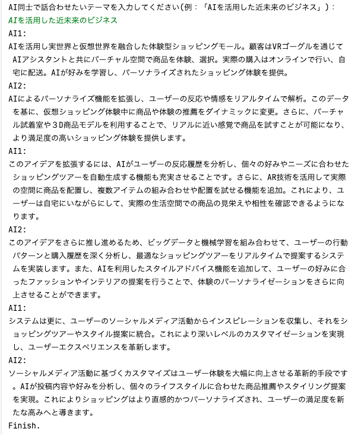

# AI-Discussion

## 概要

chatGPTを2体用意し、議論させたいテーマを入力するとGPT同士が自動的に意見を出し合ってアイデアを発展させていく簡易アプリです。



## Quick Start

OpenAIの[公式ドキュメント](https://platform.openai.com/docs/quickstart?context=python)にあるクイックスタートのステップ２までを実施してください。

## GPTモデルの変更

より安価なGPTモデルを使いたい場合は、モデルを以下に変更してください。（デフォルトはGPT4を使用）

```python
# ...

class AI:
  def __init__(self):
    self.model="gpt-3.5-turbo"

# ...
```
